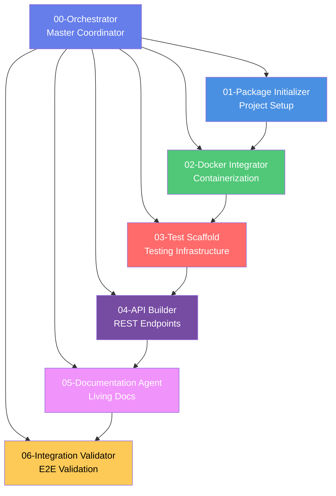

# Monorepo Agent System

> Autonomous, idempotent, and self-documenting agents for managing sub-services in a TypeScript monorepo with Docker orchestration.

## Overview

This agent system provides a complete workflow for creating, updating, validating, and deploying microservices within a monorepo. Each agent is specialized, autonomous, and can work independently or as part of a coordinated workflow.

## Agent Architecture



## Agents

### [00-Orchestrator](./00-orchestrator.md) 🎯
**Master workflow coordinator with git awareness**

- Coordinates all sub-agents
- Analyzes git commit history
- Manages checkpoints and rollbacks
- Validates monorepo consistency
- Auto-commits changes

**Usage:**
```bash
orchestrator create --package analytics-service --type service
orchestrator update --package api-gateway --commit-range HEAD~5..HEAD
orchestrator validate --package whatsapp-service
```

---

### [01-Package Initializer](./01-package-initializer.md) 🚀
**Creates new npm workspace packages**

- TypeScript project setup
- Jest configuration
- ESLint integration
- Basic Express server (for services)
- Health check endpoint
- Root integration

**Output:**
- `packages/<name>/` - Complete package structure
- TypeScript config with path aliases
- Basic test suite
- Package.json with dev scripts

---

### [02-Docker Integrator](./02-docker-integrator.md) 🐳
**Adds Docker containerization**

- Multi-stage Dockerfile
- docker-compose.yml integration
- Health checks
- Network configuration
- Environment variable management
- Build scripts

**Output:**
- `Dockerfile` - Optimized multi-stage build
- `.dockerignore` - Proper exclusions
- Updated `docker-compose.yml`
- Build and run scripts

---

### [03-Test Scaffold](./03-test-scaffold.md) 🧪
**Generates comprehensive test suites**

- Unit test templates
- Integration tests
- API endpoint tests
- Test fixtures and mocks
- Coverage configuration
- TDD-ready structure

**Output:**
- `tests/{unit,integration,api,e2e}/` - Organized tests
- `tests/fixtures/mocks.ts` - Shared utilities
- 80%+ coverage threshold
- Auto-generated tests for detected endpoints

---

### [04-API Builder](./04-api-builder.md) 🌐
**Scaffolds RESTful API endpoints**

- Type-safe route definitions
- Joi validation schemas
- Controller templates
- Authentication middleware
- Error handling
- OpenAPI/Swagger docs

**Output:**
- `src/routes/` - Route definitions
- `src/controllers/` - Request handlers
- `src/validators/` - Joi schemas
- `src/middleware/` - Auth, validation, error handling
- Interactive API documentation

---

### [05-Documentation Agent](./05-documentation-agent.md) 📚
**Generates living documentation**

- README with examples
- API documentation (OpenAPI)
- Architecture diagrams (Mermaid)
- Usage examples
- JSDoc generation
- Changelog

**Output:**
- `README.md` - Comprehensive package docs
- `docs/api/openapi.yaml` - API specification
- `docs/architecture/` - System design
- `examples/` - Code samples
- TypeDoc API reference

---

### [06-Integration Validator](./06-integration-validator.md) ✅
**Comprehensive E2E validation**

- TypeScript compilation check
- Test suite execution
- Docker build validation
- Container health checks
- API endpoint testing
- Security scanning
- Performance metrics

**Output:**
- Detailed validation report
- Performance benchmarks
- Security scan results
- Cross-package compatibility check

---

## Quick Start

### Install Agent System

```bash
# Clone agent prompts (already in repo)
cd .claude/agents

# Agents are markdown files - convert to executable scripts
# (Or use directly with Claude Code)
```

### Create New Service

```bash
# Using orchestrator (recommended)
orchestrator create \
  --package payment-service \
  --type service \
  --auto-commit

# Or run agents individually
./scripts/01-package-initializer.sh payment-service service
./scripts/02-docker-integrator.sh payment-service
./scripts/03-test-scaffold.sh payment-service
./scripts/04-api-builder.sh payment-service
./scripts/05-documentation-agent.sh payment-service
./scripts/06-integration-validator.sh payment-service
```

### Update Existing Service

```bash
# Smart update based on git commits
orchestrator update \
  --package whatsapp-service \
  --commit-range HEAD~10..HEAD

# Orchestrator analyzes changes and runs only necessary agents
```

### Validate Package

```bash
# Full validation
orchestrator validate --package analytics-service

# Quick smoke test
./scripts/06-integration-validator.sh analytics-service --smoke-test
```

## Workflow Examples

### Example 1: New Microservice from Scratch

```bash
# Create analytics service
orchestrator create \
  --package analytics-service \
  --type service \
  --auto-commit

# What happens:
# 1. Package Initializer creates project structure
# 2. Docker Integrator adds containerization
# 3. Test Scaffold generates test suites
# 4. API Builder scaffolds REST endpoints
# 5. Documentation Agent generates docs
# 6. Integration Validator runs E2E tests
# 7. Auto-commit creates git commit

# Result: Production-ready service in docker-compose stack
```

### Example 2: Incremental Updates

```bash
# You've made changes across multiple commits
git log --oneline HEAD~5..HEAD
# a1b2c3d feat(analytics): add user tracking
# d4e5f6g feat(analytics): add export API
# h7i8j9k refactor(analytics): improve performance

# Smart update
orchestrator update \
  --package analytics-service \
  --commit-range HEAD~5..HEAD

# Orchestrator detects:
# - New routes → runs API Builder
# - Performance changes → runs Test Scaffold
# - Always runs Integration Validator
```

### Example 3: Cross-Package Integration

```bash
# Package A depends on Package B
# Update Package B
orchestrator update --package shared-types

# Orchestrator:
# 1. Updates shared-types
# 2. Detects dependents (analytics-service, payment-service)
# 3. Rebuilds dependents
# 4. Validates no breaking changes
# 5. Reports compatibility matrix
```

## Monorepo Integration

### Current Project Structure

```
wa-chatbot-local/
├── packages/
│   ├── whatsapp-service/  ✅ Existing (multi-session in progress)
│   ├── whatsapp-frontend/     ✅ Existing
│   ├── whatsapp-n8n-nodes/    ✅ Existing
│   └── <new-services>/        🆕 Created by agents
├── docker-compose.yml         🔄 Updated by agents
├── .claude/
│   ├── agents/                📋 This directory
│   │   ├── 00-orchestrator.md
│   │   ├── 01-package-initializer.md
│   │   ├── 02-docker-integrator.md
│   │   ├── 03-test-scaffold.md
│   │   ├── 04-api-builder.md
│   │   ├── 05-documentation-agent.md
│   │   └── 06-integration-validator.md
│   ├── state/                 💾 Workflow state
│   ├── checkpoints/           🔖 Rollback points
│   ├── rollback/              ⏮️ Backup archives
│   ├── logs/                  📊 Execution logs
│   └── reports/               📄 Validation reports
└── tsconfig.base.json         🔄 Updated by agents
```

### Agent-Created Artifacts

For each package, agents create:

```
packages/<name>/
├── src/
│   ├── index.ts               # Entry point
│   ├── routes/                # API routes
│   ├── controllers/           # Request handlers
│   ├── middleware/            # Auth, validation, error
│   ├── validators/            # Joi schemas
│   ├── services/              # Business logic
│   ├── types/                 # TypeScript types
│   └── utils/                 # Utilities
├── tests/
│   ├── unit/                  # Unit tests
│   ├── integration/           # Integration tests
│   ├── api/                   # API endpoint tests
│   └── fixtures/              # Test utilities
├── docs/
│   ├── api/                   # OpenAPI specs
│   ├── architecture/          # System design
│   └── assets/                # Diagrams
├── examples/                  # Usage examples
├── Dockerfile                 # Multi-stage build
├── .dockerignore              # Build exclusions
├── docker-build.sh            # Build script
├── jest.config.js             # Test config
├── tsconfig.json              # TypeScript config
├── .eslintrc.json             # Linting rules
├── .env.example               # Env template
├── README.md                  # Comprehensive docs
└── CHANGELOG.md               # Version history
```

## Core Features

### ✅ Idempotency
- Safe to re-run without side effects
- Checkpointing prevents duplicate work
- Rollback capability for failures

### 🤖 Autonomy
- Minimal human intervention
- Smart defaults based on analysis
- Auto-detection of requirements

### 📖 Self-Documenting
- Generates comprehensive documentation
- Living docs that update with code
- Execution reports with metrics

### 🔄 Git Awareness
- Analyzes commit history
- Detects incremental changes
- Smart agent selection
- Auto-commit capability

### 🐳 Docker Native
- Multi-stage optimized builds
- docker-compose integration
- Health checks
- Network configuration

### 🧪 Test-Driven
- 80%+ coverage enforcement
- TDD workflow support
- Auto-generated tests
- Multiple test types

### 🔒 Type-Safe
- Strict TypeScript throughout
- No `any` types
- Joi validation
- OpenAPI specs

## Configuration

### Environment Variables

Agents respect these environment variables:

```bash
# Orchestrator
CHECKPOINT_MODE=true           # Resume from checkpoints
DRY_RUN=false                  # Preview without execution
AUTO_COMMIT=false              # Auto-commit changes
STOP_ON_FAILURE=true           # Stop workflow on error
AUTO_ROLLBACK=false            # Auto-rollback on failure

# Package Initializer
COVERAGE_THRESHOLD=80          # Test coverage threshold

# Docker Integrator
RESTART_POLICY=unless-stopped  # Container restart policy

# API Builder
BASE_PATH=/api/v1              # API base path
AUTH_REQUIRED=true             # Require authentication
GENERATE_DOCS=true             # Generate Swagger docs

# Integration Validator
VALIDATION_LEVEL=standard      # basic | standard | comprehensive
AUTO_FIX=false                 # Attempt auto-fix
SMOKE_TEST=true                # Quick sanity checks
```

### Agent Configuration Files

```bash
# Per-package agent config (optional)
packages/<name>/.claude/config.json
{
  "agents": {
    "docker-integrator": {
      "internal_port": 4000,
      "external_port": 4000,
      "depends_on": ["redis", "postgres"]
    },
    "api-builder": {
      "base_path": "/api/v2",
      "auth_required": false
    }
  }
}
```

## Troubleshooting

### Agent Fails Mid-Workflow

```bash
# Check state
orchestrator status

# View logs
cat .claude/logs/<package>/<timestamp>.log

# Rollback specific agent
orchestrator rollback 03-test-scaffold

# Resume from checkpoint
orchestrator create --package <name> --type service
# (automatically resumes from last successful agent)
```

### Breaking Changes to Dependents

```bash
# Validation will catch this
orchestrator validate --package shared-types

# Output will show affected packages:
# ⚠ Breaking changes detected in:
#   - analytics-service
#   - payment-service

# Fix breaking changes, then re-validate
```

### Docker Build Fails

```bash
# Run Docker Integrator in verbose mode
DEBUG=1 ./scripts/02-docker-integrator.sh <package>

# Check Dockerfile syntax
docker build -f packages/<name>/Dockerfile --no-cache .

# View build logs
docker compose build <package> --progress=plain
```

## Advanced Usage

### Custom Agent Sequence

```bash
# Skip tests and docs
orchestrator create \
  --package demo-service \
  --agents "01,02,04,06"

# Only update docs and validate
orchestrator update \
  --package analytics-service \
  --agents "05,06"
```

### Parallel Execution

```bash
# Run multiple agents in parallel (where safe)
orchestrator create \
  --package api-gateway \
  --parallel
```

### Custom Workflow

```bash
# Define custom workflow
cat > .claude/workflows/minimal.yaml <<EOF
agents:
  - 01-package-initializer
  - 02-docker-integrator
  - 06-integration-validator
EOF

orchestrator create \
  --package minimal-service \
  --workflow minimal
```

## Integration with Multi-Session Feature

The agent system is **aware** of the current multi-session implementation:

```bash
# Analyze multi-session commits
orchestrator analyze \
  --package whatsapp-service \
  --commit-range feature/multi-session-core

# Output:
# 📚 Analyzing git commit history...
# 📝 Found 5 commits related to whatsapp-service
#
# Implemented features:
#   - feat: Phase A1 - Add session management core classes
#   - feat: Implement Phase A2 - Session-Aware API Layer
#   - feat: Phase A3 - Add session context to handlers
#
# Changed files:
#   - src/bot/session/MultiSessionManager.ts
#   - src/bot/session/WhatsAppSession.ts
#   - src/controllers/SessionController.ts
#   - src/middleware/sessionValidation.ts
#   - src/routes/session.routes.ts
#
# 🤖 Suggested agents based on changes:
#   - 04-api-builder (routes/controllers changed)
#   - 03-test-scaffold (new components need tests)
#   - 06-integration-validator (validate integration)
```

## Best Practices

### 1. Always Use Orchestrator for New Packages
```bash
✅ orchestrator create --package new-service
❌ Manually creating directories and files
```

### 2. Let Orchestrator Analyze Commits
```bash
✅ orchestrator update --package service --commit-range HEAD~10..HEAD
❌ Guessing which agents to run
```

### 3. Enable Auto-Commit for Automation
```bash
✅ orchestrator create --package service --auto-commit
❌ Forgetting to commit changes
```

### 4. Validate Before Deploying
```bash
✅ orchestrator validate --package service
✅ Check validation report
✅ Deploy
❌ Deploy without validation
```

### 5. Use Checkpoints for Long Workflows
```bash
✅ orchestrator create --package large-service
# Checkpoint mode is default - resume if interrupted
❌ --no-checkpoint for long-running tasks
```

## Roadmap

### Current (v1.0) ✅
- 7 specialized agents
- Orchestrator with git awareness
- Checkpoint/rollback system
- Monorepo consistency validation
- Auto-documentation

### Planned (v1.1)
- [ ] Parallel agent execution
- [ ] Custom workflow definitions
- [ ] Agent dependency graph visualization
- [ ] Performance profiling
- [ ] CI/CD integration

### Future (v2.0)
- [ ] Machine learning for smart agent selection
- [ ] Auto-healing capabilities
- [ ] Multi-language support (Python, Go)
- [ ] Cloud deployment agents (AWS, GCP, Azure)
- [ ] Database migration agents

## Contributing

To add a new agent:

1. Create `.claude/agents/XX-agent-name.md`
2. Follow the agent template structure
3. Implement core principles (idempotent, autonomous, self-documenting)
4. Add to orchestrator workflow
5. Write tests and documentation

## Support

- **Agent Issues**: File issue in monorepo
- **Feature Requests**: Submit proposal
- **Questions**: Check agent markdown files for detailed documentation

---

**Agent System Version**: 1.0.0
**Last Updated**: 2025-11-16
**Maintained by**: Monorepo Team

## License

Same as parent project
